# Agentic Text-to-SQL Platform: Production-Grade System Design

## Table of Contents

1. [High-Level System Architecture](#1-high-level-system-architecture)
2. [Agentic Workflow](#2-agentic-workflow)
3. [LangGraph Architecture](#3-langgraph-architecture)
4. [End-to-End Request Lifecycle](#4-end-to-end-request-lifecycle)
5. [Metadata Strategy](#5-metadata-strategy)
6. [Retrieval Strategy](#6-retrieval-strategy)
7. [SQL Generation Strategy](#7-sql-generation-strategy)
8. [Security & Enterprise Guardrails](#8-security--enterprise-guardrails)
9. [Failure Scenarios](#9-failure-scenarios)
10. [Scalability](#10-scalability)
11. [Observability](#11-observability)
12. [Workspace Strategy](#12-workspace-strategy)
13. [Evaluation & Testing Strategy](#13-evaluation--testing-strategy)
14. [Architecture Decisions](#14-architecture-decisions)

---

## 1. High-Level System Architecture

### Architecture Diagram

```mermaid
graph TB
    subgraph "Client Layer"
        UI[Web UI / Chat Interface]
        API_CLIENT[API Clients / SDKs]
        SLACK[Slack / Teams Bot]
    end

    subgraph "API Gateway & Auth"
        GW[API Gateway<br/>Kong / AWS ALB]
        AUTH[Auth Service<br/>OAuth2 / OIDC]
        RL[Rate Limiter<br/>Redis-based]
    end

    subgraph "Core Backend Services"
        ORCH[Orchestration Service<br/>FastAPI]
        CONV[Conversation Manager<br/>Session & History]
        CACHE_SVC[Cache Service<br/>Redis Cluster]
    end

    subgraph "Agentic Workflow Engine"
        LG[LangGraph Runtime]
        subgraph "Agent Pipeline"
            INTENT[Intent Agent]
            SCHEMA[Schema Agent]
            SQL_GEN[SQL Generator Agent]
            VALIDATOR[Validator Agent]
            EXECUTOR[Executor Agent]
            FORMATTER[Formatter Agent]
        end
        CKPT[Checkpoint Store<br/>PostgreSQL]
    end

    subgraph "LLM Layer"
        LLM_GW[LLM Gateway<br/>Load Balancer + Fallback]
        LLM1[Claude / GPT-4<br/>Primary]
        LLM2[Claude / GPT-4<br/>Fallback]
        LLM3[Smaller Model<br/>Classification Tasks]
    end

    subgraph "Knowledge & Retrieval Layer"
        VS[Vector Store<br/>Pinecone / pgvector]
        META_DB[Metadata Store<br/>PostgreSQL]
        BG[Business Glossary<br/>PostgreSQL]
        QH[Query History Store<br/>PostgreSQL]
        EMB[Embedding Service<br/>Ada / Cohere]
    end

    subgraph "SQL Execution Layer"
        PROXY[Query Proxy<br/>Read-Only Enforcer]
        QG[Query Governor<br/>Cost & Timeout Limits]
        CONN[Connection Pool<br/>Per-Warehouse]
    end

    subgraph "Data Warehouse(s)"
        DW1[Snowflake]
        DW2[BigQuery]
        DW3[Redshift / Databricks]
    end

    subgraph "Security Layer"
        RBAC_SVC[RBAC / ABAC Engine]
        PII[PII Detector<br/>Presidio / Custom]
        MASK[Data Masking Service]
        GUARD[Guardrail Service<br/>Prompt Injection Detection]
    end

    subgraph "Observability & Audit"
        TRACE[Distributed Tracing<br/>OpenTelemetry + Jaeger]
        LOG[Centralized Logging<br/>ELK / Datadog]
        METRICS[Metrics<br/>Prometheus + Grafana]
        AUDIT[Audit Log<br/>Immutable Store]
        FB[Feedback Service]
    end

    subgraph "Async Infrastructure"
        MQ[Message Queue<br/>Kafka / SQS]
        SYNC[Schema Sync Worker<br/>Scheduled Jobs]
    end

    %% Client to Gateway
    UI --> GW
    API_CLIENT --> GW
    SLACK --> GW

    %% Gateway to Backend
    GW --> AUTH
    GW --> RL
    AUTH --> ORCH

    %% Backend to Agent Engine
    ORCH --> CONV
    ORCH --> CACHE_SVC
    ORCH --> LG
    LG --> CKPT

    %% Agent Pipeline Flow
    INTENT --> SCHEMA
    SCHEMA --> SQL_GEN
    SQL_GEN --> VALIDATOR
    VALIDATOR --> EXECUTOR
    EXECUTOR --> FORMATTER

    %% Agents to LLM
    INTENT --> LLM_GW
    SCHEMA --> LLM_GW
    SQL_GEN --> LLM_GW
    VALIDATOR --> LLM_GW
    FORMATTER --> LLM_GW
    LLM_GW --> LLM1
    LLM_GW --> LLM2
    LLM_GW --> LLM3

    %% Agents to Knowledge
    SCHEMA --> VS
    SCHEMA --> META_DB
    SCHEMA --> BG
    INTENT --> QH
    VS --> EMB

    %% Execution
    EXECUTOR --> PROXY
    PROXY --> QG
    QG --> CONN
    CONN --> DW1
    CONN --> DW2
    CONN --> DW3

    %% Security
    ORCH --> RBAC_SVC
    VALIDATOR --> GUARD
    EXECUTOR --> PII
    FORMATTER --> MASK

    %% Observability
    LG --> TRACE
    ORCH --> LOG
    ORCH --> METRICS
    ORCH --> AUDIT
    FORMATTER --> FB

    %% Async
    SYNC --> META_DB
    SYNC --> VS
    MQ --> SYNC
```

### Component Responsibilities

| Component | Responsibility |
|-----------|---------------|
| **API Gateway** | TLS termination, request routing, protocol translation, initial rate limiting |
| **Auth Service** | OAuth2/OIDC token validation, user identity resolution, session management |
| **Rate Limiter** | Per-user and per-org request throttling using token bucket algorithm |
| **Orchestration Service** | Entry point for all queries; manages request lifecycle, invokes LangGraph, returns responses |
| **Conversation Manager** | Maintains multi-turn conversation state, resolves coreferences ("those customers" → previous result set) |
| **Cache Service** | Two-tier cache: (1) semantic cache for similar NL queries, (2) exact-match cache for repeated SQL results |
| **LangGraph Runtime** | Executes the agentic workflow as a stateful graph; handles branching, retries, and checkpointing |
| **Checkpoint Store** | Persists LangGraph state for resumability, debugging, and human-in-the-loop interrupts |
| **LLM Gateway** | Routes LLM calls with load balancing, fallback, retry, token tracking, and model selection |
| **Vector Store** | Stores embeddings of table/column descriptions, business terms, and past queries for semantic retrieval |
| **Metadata Store** | Relational store for schema metadata: tables, columns, relationships, statistics, lineage |
| **Business Glossary** | Maps business terms ("revenue", "active user", "churn") to precise SQL definitions |
| **Query History Store** | Stores past NL→SQL pairs with feedback scores for few-shot retrieval and fine-tuning |
| **Embedding Service** | Generates embeddings for metadata, queries, and business terms |
| **Query Proxy** | Enforces read-only access; rewrites or rejects mutating statements |
| **Query Governor** | Enforces cost estimates, row limits, timeout thresholds; kills expensive queries |
| **Connection Pool** | Manages warehouse connections per tenant/database with credential rotation |
| **RBAC/ABAC Engine** | Evaluates user permissions against tables, columns, and row-level policies |
| **PII Detector** | Scans query results for PII (SSN, email, phone) before returning to user |
| **Data Masking Service** | Applies masking rules (redact, hash, truncate) to sensitive columns in results |
| **Guardrail Service** | Detects prompt injection, jailbreak attempts, and dangerous SQL patterns |
| **Distributed Tracing** | End-to-end trace across all agents and services via OpenTelemetry |
| **Audit Log** | Immutable, append-only log of every query, SQL generated, results returned, and who accessed what |
| **Feedback Service** | Collects thumbs-up/down, corrections, and preferred SQL from users |
| **Schema Sync Worker** | Periodically syncs warehouse schemas into metadata store and re-indexes embeddings |

---

## 2. Agentic Workflow

### Why an Agentic Architecture?

Text-to-SQL over 1000+ tables is not a single-prompt problem. It requires:

- **Staged reasoning**: Each step (understanding intent, finding tables, generating SQL) requires different context and skills.
- **Conditional branching**: Ambiguous queries need clarification; invalid SQL needs repair; expensive queries need approval.
- **Separation of concerns**: Security checks, SQL generation, and result formatting have fundamentally different failure modes and should be independently testable.
- **Controlled context windows**: With 1000+ tables, the LLM cannot see everything at once. Each agent operates on a focused subset.

### Agent Roster

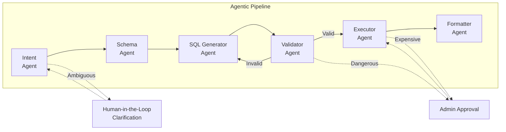

### Agent Details

#### Agent 1: Intent Agent

| Attribute | Detail |
|-----------|--------|
| **Purpose** | Understand the user's natural language question, resolve ambiguity, classify intent, and extract key entities |
| **Inputs** | User's NL query, conversation history, user profile (role, department, default database) |
| **Outputs** | Structured intent object: `{ intent_type, entities, time_range, filters, aggregations, sort_order, ambiguities, domain }` |
| **Internal Reasoning** | Classify query type (analytical, lookup, comparison, trend). Extract temporal references and resolve relative dates ("last 3 years" → 2023-2026). Detect ambiguity and determine if clarification is needed. |
| **Tools** | Business Glossary Lookup, Query History Search (for similar past queries), Conversation History |
| **Has Access To** | Business glossary, conversation history, user profile, query history |
| **Does NOT Have Access To** | Raw schema metadata, SQL execution, warehouse credentials |
| **Why Separate** | Intent understanding is a distinct NLP task. Mixing it with schema selection would overload the LLM context and conflate two different reasoning objectives. Intent errors propagate downstream—isolating this step makes them catchable early. |

**Ambiguity Resolution Protocol:**
- If "sales" could mean `gross_sales`, `net_sales`, or `units_sold` → interrupt and ask user
- If time range is unspecified for a temporal query → use department default or ask
- If query references a term not in the business glossary → flag for clarification

#### Agent 2: Schema Agent

| Attribute | Detail |
|-----------|--------|
| **Purpose** | Identify the minimal set of tables and columns needed to answer the query |
| **Inputs** | Structured intent from Intent Agent, user's RBAC permissions |
| **Outputs** | `{ selected_tables[], selected_columns[], join_paths[], filtered_tables_by_rbac }` |
| **Internal Reasoning** | Perform semantic search over table/column embeddings. Use business glossary to map intent entities to exact columns. Traverse foreign key graph to find join paths. Filter out tables the user lacks permission to access. Rank candidate schemas by relevance. |
| **Tools** | Vector Search (table/column embeddings), Metadata Store Query, FK Graph Traversal, RBAC Permission Check |
| **Has Access To** | Full metadata store, vector index, FK relationships, RBAC policies, business glossary |
| **Does NOT Have Access To** | Actual data in the warehouse, SQL execution, conversation history (unnecessary at this stage) |
| **Why Separate** | Schema selection over 1000+ tables is the hardest retrieval problem in the system. It requires specialized tools (vector search, graph traversal) and careful RBAC filtering. Combining this with SQL generation would create a prompt too large and with too many competing objectives. |

**Multi-Database Routing:**
- If the intent spans multiple domains (e.g., "compare marketing spend to sales revenue"), the Schema Agent identifies tables from multiple warehouses and flags a cross-database query.

#### Agent 3: SQL Generator Agent

| Attribute | Detail |
|-----------|--------|
| **Purpose** | Generate syntactically and semantically correct SQL from the intent and selected schema |
| **Inputs** | Structured intent, selected tables/columns, join paths, database dialect, few-shot examples |
| **Outputs** | `{ sql_query, explanation, confidence_score, assumptions_made[] }` |
| **Internal Reasoning** | Construct SQL using the selected schema. Apply dialect-specific syntax (Snowflake vs BigQuery vs Redshift). Use few-shot examples from query history for similar patterns. Document any assumptions (e.g., "assumed 'revenue' means `net_revenue_usd`"). |
| **Tools** | Few-Shot Example Retriever (from query history), SQL Dialect Reference, Business Rule Lookup |
| **Has Access To** | Selected schema subset (not full 1000+ table catalog), intent object, few-shot examples, dialect rules |
| **Does NOT Have Access To** | Full metadata store (only sees pre-filtered schema), warehouse credentials, user PII |
| **Why Separate** | SQL generation is the core LLM reasoning task and benefits from a focused, well-structured prompt with minimal noise. Receiving only the relevant schema subset (typically 3-15 tables) keeps the prompt under 4K tokens of schema context, maximizing generation quality. |

#### Agent 4: Validator Agent

| Attribute | Detail |
|-----------|--------|
| **Purpose** | Validate the generated SQL for correctness, safety, and policy compliance |
| **Inputs** | Generated SQL, selected schema, user permissions, guardrail policies |
| **Outputs** | `{ is_valid, validation_errors[], is_safe, safety_flags[], needs_approval, optimized_sql }` |
| **Internal Reasoning** | Parse SQL AST to verify all referenced tables/columns exist. Check for SQL injection patterns. Verify no DML/DDL statements. Check column-level permissions. Estimate query cost. Detect unsafe patterns (SELECT *, CROSS JOIN without filter, unbounded scans). Suggest LIMIT clause if missing. |
| **Tools** | SQL Parser (sqlglot), Schema Validator, Cost Estimator (EXPLAIN plan), Guardrail Rule Engine, RBAC Checker |
| **Has Access To** | SQL AST, schema metadata, RBAC policies, guardrail rules, cost estimation APIs |
| **Does NOT Have Access To** | Actual query execution, result data, business glossary (not needed at validation stage) |
| **Why Separate** | Validation is a fundamentally different task from generation—it's more rule-based and deterministic. Separating it creates a clear security boundary: the Generator can be creative, but nothing executes without passing the Validator. This is the primary defense against hallucinated or dangerous SQL. |

**Validation Checks:**
1. **Syntactic**: Parse SQL with sqlglot; reject if unparseable
2. **Schema**: Every table and column in the SQL must exist in the selected schema
3. **Permission**: User must have access to all referenced tables and columns
4. **Safety**: No DDL/DML, no `DROP`, `DELETE`, `UPDATE`, `INSERT`, `TRUNCATE`
5. **Cost**: Estimated scan size < threshold (e.g., 10TB). If exceeded → require approval
6. **Guardrails**: No sensitive columns without masking; PII columns flagged
7. **Optimization**: Add `LIMIT` if missing, suggest partition filters

**Self-Correction Loop:**
If validation fails → return errors to SQL Generator Agent with specific feedback → Generator produces corrected SQL → re-validate. Maximum 3 iterations before escalating to human.

#### Agent 5: Executor Agent

| Attribute | Detail |
|-----------|--------|
| **Purpose** | Execute validated SQL against the data warehouse safely |
| **Inputs** | Validated SQL, target warehouse, execution parameters (timeout, row limit) |
| **Outputs** | `{ result_rows[], row_count, execution_time_ms, truncated, error }` |
| **Internal Reasoning** | Select correct warehouse connection. Set query timeout. Execute via read-only proxy. Monitor execution time. Truncate results if they exceed row limits. Handle database errors gracefully. |
| **Tools** | Query Proxy (read-only connection), Query Governor (timeout/cost enforcement) |
| **Has Access To** | Read-only warehouse connections (via proxy), execution parameters |
| **Does NOT Have Access To** | Write access to any database, LLM services (no reasoning needed), user profile |
| **Why Separate** | Execution is an I/O operation with security implications. Isolating it behind a read-only proxy with strict timeouts and row limits prevents the agentic system from accidentally modifying data. This agent has the most restricted tool access of any agent. |

#### Agent 6: Formatter Agent

| Attribute | Detail |
|-----------|--------|
| **Purpose** | Transform raw query results into a human-friendly response |
| **Inputs** | Raw result rows, original NL question, SQL used, user preferences |
| **Outputs** | `{ natural_language_answer, formatted_table, chart_suggestion, sql_shown, caveats[] }` |
| **Internal Reasoning** | Generate a natural language summary answering the user's question. Format numbers (currency, percentages). Suggest visualization type (bar chart for comparisons, line chart for trends). Note any caveats ("results limited to 1000 rows", "data as of yesterday"). Apply data masking to PII columns. |
| **Tools** | PII Detector, Data Masking Service, Visualization Recommender |
| **Has Access To** | Query results, original question, SQL explanation, masking rules |
| **Does NOT Have Access To** | Warehouse connections, full schema metadata, RBAC policies (masking already applied) |
| **Why Separate** | Formatting is a user-facing concern and the last place to apply data masking. Separating it ensures that even if earlier agents miss a PII column, the Formatter's PII scan catches it before the user sees the data. |

### Shared State Across the Graph

```python
class Text2SQLState(TypedDict):
    # Input
    user_query: str
    user_id: str
    session_id: str
    conversation_history: list[dict]

    # Intent Agent Output
    intent: IntentResult
    needs_clarification: bool
    clarification_question: str

    # Schema Agent Output
    selected_tables: list[TableSchema]
    selected_columns: list[ColumnSchema]
    join_paths: list[JoinPath]
    rbac_filtered: list[str]  # tables removed due to permissions

    # SQL Generator Output
    generated_sql: str
    sql_explanation: str
    sql_confidence: float
    assumptions: list[str]

    # Validator Output
    is_valid: bool
    validation_errors: list[str]
    is_safe: bool
    safety_flags: list[str]
    needs_approval: bool
    optimized_sql: str

    # Executor Output
    query_results: list[dict]
    row_count: int
    execution_time_ms: int
    execution_error: str

    # Formatter Output
    final_response: str
    formatted_table: str
    chart_suggestion: str
    caveats: list[str]

    # Control Flow
    retry_count: int
    max_retries: int
    current_agent: str
    error_history: list[str]
    trace_id: str
```

---

## 3. LangGraph Architecture

### Why LangGraph?

| Requirement | LangGraph Capability |
|-------------|---------------------|
| Multi-agent orchestration with conditional routing | First-class support for conditional edges and branching |
| Stateful execution with persistence | Built-in checkpointing to PostgreSQL, SQLite, or custom backends |
| Human-in-the-loop interrupts | Native `interrupt_before` / `interrupt_after` on any node |
| Retry and error recovery | Resume from any checkpoint; re-execute failed nodes |
| Observability | Integrated with LangSmith for full execution traces |
| Streaming | Supports streaming intermediate results to the UI |
| Parallel execution | Supports parallel branches via `Send` API |
| Production deployment | LangGraph Platform for managed deployment; or self-hosted with LangGraph SDK |

**Alternatives considered:** CrewAI (too opinionated, less control over routing), AutoGen (complex multi-agent messaging model), raw LangChain (lacks graph-based orchestration and checkpointing). LangGraph provides the right balance of control, observability, and production-readiness.

### Graph Definition

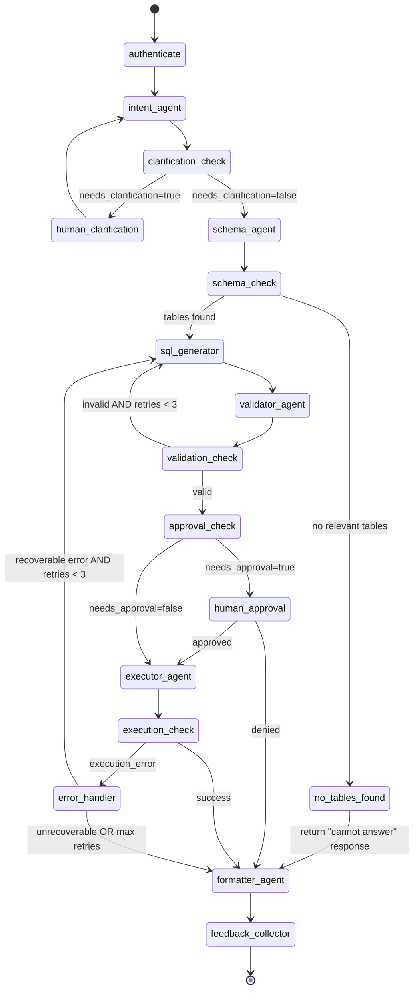

### LangGraph Implementation

```python
from langgraph.graph import StateGraph, END
from langgraph.checkpoint.postgres import PostgresSaver
from langgraph.errors import NodeInterrupt

# ─── Graph Construction ───

builder = StateGraph(Text2SQLState)

# ─── Nodes ───
builder.add_node("authenticate", authenticate_user)
builder.add_node("intent_agent", run_intent_agent)
builder.add_node("schema_agent", run_schema_agent)
builder.add_node("sql_generator", run_sql_generator)
builder.add_node("validator_agent", run_validator_agent)
builder.add_node("executor_agent", run_executor_agent)
builder.add_node("formatter_agent", run_formatter_agent)
builder.add_node("error_handler", handle_error)
builder.add_node("feedback_collector", collect_feedback)

# ─── Entry Point ───
builder.set_entry_point("authenticate")

# ─── Edges ───
builder.add_edge("authenticate", "intent_agent")

# Conditional: does the user's query need clarification?
builder.add_conditional_edges(
    "intent_agent",
    route_after_intent,
    {
        "clarify": "intent_agent",      # interrupt + re-enter
        "proceed": "schema_agent",
    }
)

# Conditional: did schema agent find relevant tables?
builder.add_conditional_edges(
    "schema_agent",
    route_after_schema,
    {
        "no_tables": "formatter_agent",  # graceful "can't answer"
        "tables_found": "sql_generator",
    }
)

builder.add_edge("sql_generator", "validator_agent")

# Conditional: is the SQL valid?
builder.add_conditional_edges(
    "validator_agent",
    route_after_validation,
    {
        "invalid_retry": "sql_generator",
        "valid_needs_approval": "executor_agent",  # interrupt_before
        "valid": "executor_agent",
    }
)

# Conditional: did execution succeed?
builder.add_conditional_edges(
    "executor_agent",
    route_after_execution,
    {
        "success": "formatter_agent",
        "error": "error_handler",
    }
)

# Conditional: is the error recoverable?
builder.add_conditional_edges(
    "error_handler",
    route_after_error,
    {
        "retry": "sql_generator",
        "give_up": "formatter_agent",
    }
)

builder.add_edge("formatter_agent", "feedback_collector")
builder.add_edge("feedback_collector", END)

# ─── Interrupts for Human-in-the-Loop ───
# Clarification: interrupt inside intent_agent via NodeInterrupt
# Approval: interrupt_before executor_agent when needs_approval=True

# ─── Checkpointing ───
checkpointer = PostgresSaver.from_conn_string(POSTGRES_CONN_STRING)

# ─── Compile ───
graph = builder.compile(
    checkpointer=checkpointer,
    interrupt_before=["executor_agent"],  # conditional interrupt for approval
)
```

### Node Implementation Patterns

```python
# ─── Intent Agent Node ───
def run_intent_agent(state: Text2SQLState) -> dict:
    if state.get("needs_clarification"):
        # This is a re-entry after human clarification
        # The user's clarifying answer is in the updated user_query
        pass

    # Retrieve similar past queries for context
    similar_queries = query_history_store.search(state["user_query"], top_k=5)

    # Look up business terms
    glossary_matches = business_glossary.lookup(state["user_query"])

    # Call LLM to parse intent
    intent_result = llm.invoke(
        intent_prompt.format(
            query=state["user_query"],
            conversation_history=state["conversation_history"],
            glossary=glossary_matches,
            similar_queries=similar_queries,
        )
    )

    if intent_result.ambiguities:
        # Raise interrupt for human clarification
        raise NodeInterrupt(
            f"I need clarification: {intent_result.clarification_question}"
        )

    return {
        "intent": intent_result,
        "needs_clarification": False,
    }


# ─── Routing Functions ───
def route_after_validation(state: Text2SQLState) -> str:
    if not state["is_valid"] and state["retry_count"] < state["max_retries"]:
        return "invalid_retry"
    if state["needs_approval"]:
        return "valid_needs_approval"
    return "valid"


def route_after_error(state: Text2SQLState) -> str:
    error = state["execution_error"]
    if is_recoverable(error) and state["retry_count"] < state["max_retries"]:
        return "retry"
    return "give_up"
```

### Checkpointing & Memory

- **Checkpoint store**: PostgreSQL via `PostgresSaver` — every node execution persists the full state
- **Resumability**: If the process crashes mid-execution, it resumes from the last completed node
- **Human-in-the-loop**: When a `NodeInterrupt` fires, the state is saved. When the user responds, `graph.invoke(user_response, config={"configurable": {"thread_id": thread_id}})` resumes from the interrupt
- **Conversation memory**: Managed externally in the Conversation Manager; passed into the graph as `conversation_history` in the initial state. This keeps the LangGraph state focused on the current query while the Conversation Manager handles multi-turn context.

### Retry Mechanisms

| Failure | Retry Strategy |
|---------|---------------|
| SQL validation failure | Re-route to SQL Generator with error feedback, max 3 retries |
| Database timeout | Retry once with increased timeout; then suggest query simplification |
| LLM API error (429, 500) | Exponential backoff with jitter, fall back to secondary LLM |
| Schema agent finds no tables | No retry; return "unable to answer" with suggestions |
| Execution returns empty results | Return empty result with natural language explanation; no retry |

### Parallel Branches

Parallel execution is used in two places:

1. **Schema Agent internals**: Vector search, keyword search, and graph traversal run in parallel, then results are merged and reranked.
2. **Post-execution**: PII detection and visualization recommendation run in parallel within the Formatter Agent.

These are implemented as parallel tool calls within the respective agent nodes, not as separate LangGraph branches, to keep the graph topology simple.

---

## 4. End-to-End Request Lifecycle

### Example: "Top 10 customers by revenue in Europe"

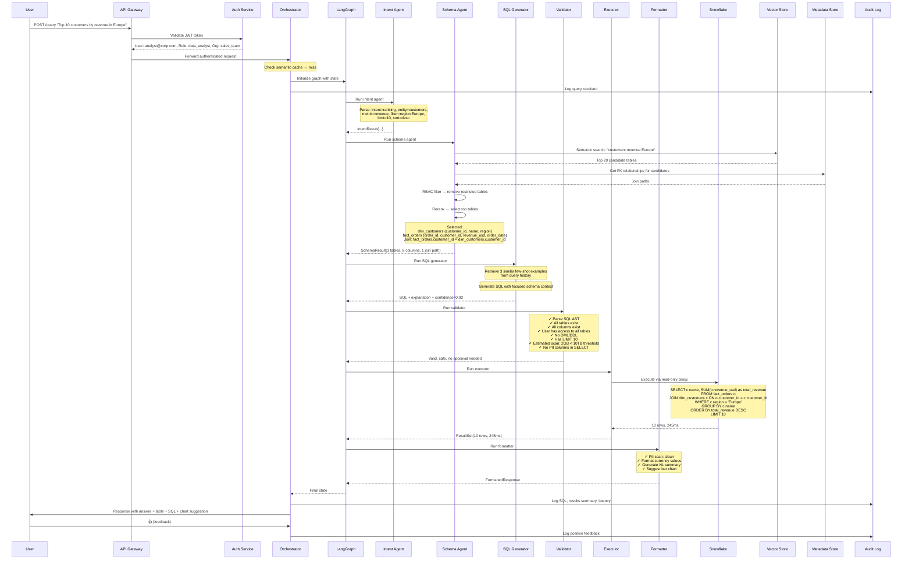

### Stage-by-Stage Detail

#### Stage 1: Authentication (5-15ms)

The API Gateway validates the JWT token against the identity provider (Okta, Auth0, or corporate OIDC). The token contains:
- `user_id`, `email`, `roles[]`, `org_id`, `department`
- `data_access_groups[]` — which data domains the user can access

The Auth Service resolves this into a `UserContext` object that travels with the request through the entire pipeline. No agent ever queries the auth service directly — they receive pre-resolved permissions.

#### Stage 2: Intent Understanding (200-500ms)

The Intent Agent receives the NL query and conversation history. It calls the LLM with a structured prompt:

```
You are a query intent parser for an enterprise data warehouse.

Given the user's question, extract:
- intent_type: one of [ranking, aggregation, comparison, trend, lookup, filter]
- entities: business objects mentioned (customers, orders, products, etc.)
- metrics: measures to compute (revenue, count, average, etc.)
- filters: conditions (region=Europe, date ranges, etc.)
- sort_order: asc/desc
- limit: number of results
- time_range: explicit or implicit temporal bounds
- ambiguities: anything unclear that needs clarification

User question: "Top 10 customers by revenue in Europe"
Business glossary matches: revenue → net_revenue_usd (fact_orders.revenue_usd)
```

Output:
```json
{
  "intent_type": "ranking",
  "entities": ["customers"],
  "metrics": ["revenue"],
  "filters": [{"field": "region", "operator": "=", "value": "Europe"}],
  "sort_order": "desc",
  "limit": 10,
  "time_range": null,
  "ambiguities": []
}
```

#### Stage 3: Schema Discovery & Table Selection (300-800ms)

The Schema Agent performs multi-strategy retrieval:

1. **Semantic search** (parallel): Embed the query "customers revenue Europe" → search vector store → top 20 candidate tables
2. **Keyword search** (parallel): Search metadata for exact matches on "customer", "revenue", "europe"
3. **Business glossary** (parallel): "revenue" → maps to `fact_orders.revenue_usd`

Results are merged, deduplicated, and reranked. Then:

4. **FK graph traversal**: For the top candidate tables, find shortest join paths
5. **RBAC filter**: Remove tables the user's role cannot access
6. **Column selection**: From selected tables, pick only columns relevant to the query

The agent outputs a compact schema context (typically 500-2000 tokens) containing only what the SQL Generator needs.

#### Stage 4: Context Retrieval & Few-Shot Examples (100-200ms)

The system retrieves 3-5 similar past NL→SQL pairs from the Query History Store:
- Semantic similarity to the current query
- Same domain/tables
- High feedback scores (thumbs-up from users)

These serve as few-shot examples in the SQL generation prompt.

#### Stage 5: SQL Generation (500-1500ms)

The SQL Generator receives a focused prompt:

```
Generate a SQL query for Snowflake.

User question: "Top 10 customers by revenue in Europe"

Available schema:
  dim_customers: customer_id (INT PK), name (VARCHAR), region (VARCHAR), ...
  fact_orders: order_id (INT PK), customer_id (INT FK→dim_customers), revenue_usd (DECIMAL), order_date (DATE), ...

Join paths:
  fact_orders.customer_id = dim_customers.customer_id

Similar examples:
  Q: "Top 5 products by sales" → SELECT p.name, SUM(o.amount) ...
  Q: "Biggest customers in APAC" → SELECT c.name, SUM(o.revenue_usd) ...

Rules:
- Always use explicit JOIN syntax
- Always include a LIMIT clause
- Use aliases for readability
- Filter using WHERE, not HAVING, when possible
```

#### Stage 6: SQL Validation (50-200ms)

Primarily deterministic, with an optional LLM check:

1. **AST parsing** via sqlglot — fast, deterministic
2. **Schema validation** — verify every identifier exists
3. **Permission check** — verify column-level access
4. **Safety rules** — regex + AST analysis for dangerous patterns
5. **Cost estimation** — `EXPLAIN` plan if supported by the warehouse
6. **Semantic check** (optional LLM call) — "Does this SQL actually answer the question?"

#### Stage 7: SQL Execution (100ms-30s)

- Execute through read-only proxy with `statement_timeout = 30s`
- Row limit enforced: max 10,000 rows returned to the application
- If the warehouse supports it, use `EXPLAIN` first to check estimated cost

#### Stage 8: Result Formatting (200-500ms)

- PII scan on result data
- Number formatting (currency symbols, thousands separators)
- Natural language summary: "The top customer in Europe by revenue is Acme Corp with $12.4M, followed by..."
- Visualization suggestion: bar chart for rankings, line chart for time series
- Caveats: "Note: revenue is in USD. Results include all-time data since no date filter was specified."

#### Stage 9: Logging & Feedback (async, <50ms from user's perspective)

Asynchronously (via message queue):
- Audit log: full trace of query → intent → schema → SQL → results
- Metrics: latency per agent, token usage, cache hit/miss
- The user can provide feedback (thumbs up/down, SQL correction), which updates the Query History Store

### Lifecycle for Other Example Queries

**"How many sales happened in the last 3 years?"**
- Intent Agent resolves "last 3 years" to `2023-06-25 to 2026-06-25`
- Schema Agent finds `fact_sales` with `sale_date` column
- SQL: `SELECT COUNT(*) FROM fact_sales WHERE sale_date >= '2023-06-25'`
- Formatter: "There were 2,847,392 sales in the last 3 years."

**"Average order value by quarter"**
- Intent Agent: aggregation, metric=average order value, grouping=quarter
- Schema Agent: `fact_orders` with `order_total`, `order_date`
- SQL: `SELECT DATE_TRUNC('quarter', order_date) AS quarter, AVG(order_total) AS avg_order_value FROM fact_orders GROUP BY 1 ORDER BY 1`
- Formatter: table + line chart suggestion showing trend

**"Compare sales between Q1 and Q2"**
- Intent Agent: comparison, implicit current year (2026), Q1 vs Q2
- Ambiguity check: "Q1 and Q2 of which year? Assuming 2026." (stated as caveat, not an interrupt, since current year is a reasonable default)
- SQL: `SELECT CASE WHEN ... END AS quarter, SUM(amount) FROM ... WHERE ... GROUP BY 1`
- Formatter: side-by-side comparison table + grouped bar chart

---

## 5. Metadata Strategy

### Schema Metadata Store (PostgreSQL)

The metadata store is the foundation of the system. It stores structured information about every table and column in the warehouse.

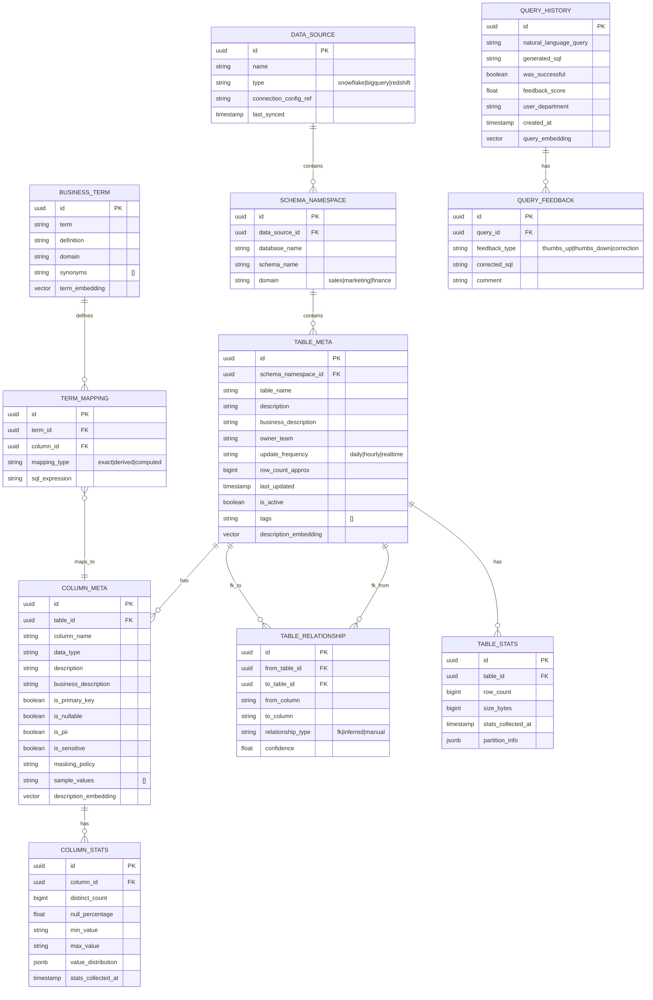

### Business Glossary

The business glossary is the most critical metadata component. It bridges the gap between business language and database schema.

```
Term: "Revenue"
Definition: "Net revenue after refunds and discounts, in USD"
SQL Expression: "fact_orders.revenue_usd"
Synonyms: ["sales", "income", "earnings", "top line"]
Domain: Finance
Owner: finance-data-team@corp.com

Term: "Active Customer"
Definition: "Customer with at least one order in the last 90 days"
SQL Expression: "EXISTS (SELECT 1 FROM fact_orders WHERE customer_id = dim_customers.customer_id AND order_date >= CURRENT_DATE - INTERVAL '90 days')"
Domain: Sales
```

Without this glossary, the LLM would guess which column "revenue" maps to — a common source of hallucination.

### Embedding & Vector Indexing Strategy

**What gets embedded:**
- Table descriptions (business_description field)
- Column descriptions (business_description field)
- Business terms and their definitions
- Past NL queries (from query history)

**Embedding model:** OpenAI `text-embedding-3-large` (3072 dimensions) or Cohere `embed-english-v3.0`

**Vector store:** pgvector extension in the same PostgreSQL instance as the metadata store (simplifies operations). For larger deployments, a dedicated Pinecone or Weaviate instance.

**Indexing strategy:**
- One index for table-level embeddings (~1000-5000 entries) — HNSW index with cosine similarity
- One index for column-level embeddings (~10,000-50,000 entries) — HNSW index
- One index for business terms (~500-2000 entries) — HNSW index
- One index for past queries (~100,000+ entries) — IVFFlat index for scale

At 1000 tables with an average of 15 columns, the column index has ~15,000 entries. HNSW handles this with sub-millisecond latency.

### Metadata Synchronization

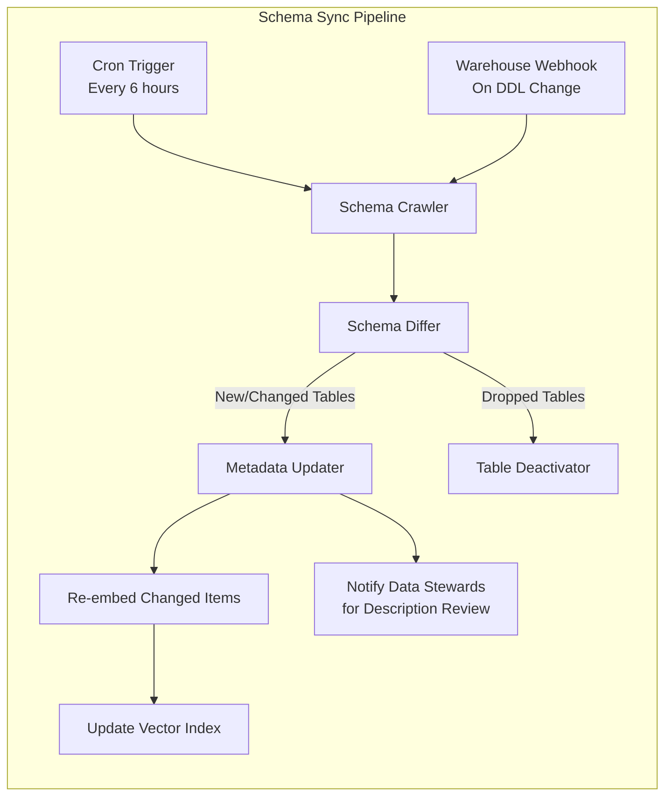

**Sync process:**
1. **Scheduled crawl** (every 6 hours): Query `INFORMATION_SCHEMA` from each warehouse to get current tables, columns, data types
2. **Event-driven** (preferred): If the warehouse supports DDL event notifications (Snowflake supports this), trigger sync on schema changes
3. **Diff detection**: Compare crawled schema against metadata store; identify new, changed, and dropped objects
4. **New tables**: Added with `is_active=false` and empty descriptions. Data stewards are notified to add business descriptions.
5. **Changed columns**: Updated automatically; embeddings re-generated
6. **Dropped tables**: Marked `is_active=false`, not deleted (preserves historical query context)
7. **Statistics refresh**: Row counts, distinct counts, and value distributions are refreshed on a separate daily schedule (these queries can be expensive)

### How Relevant Tables Are Retrieved Without Overwhelming the LLM

This is solved through a **funnel approach**:

```
1000+ tables
    ↓ Vector search + keyword search + glossary → 20-30 candidates
    ↓ Reranking (cross-encoder or LLM-based) → 5-10 tables
    ↓ FK graph traversal (add necessary join tables) → 5-15 tables
    ↓ RBAC filter (remove unauthorized) → 3-12 tables
    ↓ Column pruning (only relevant columns) → 30-80 columns
    ↓ Schema compression (compact DDL format) → 500-2000 tokens
```

The SQL Generator never sees more than ~2000 tokens of schema context. This is the key architectural insight: **table selection is a retrieval problem, not a generation problem.**

---

## 6. Retrieval Strategy

### Multi-Strategy Retrieval Pipeline

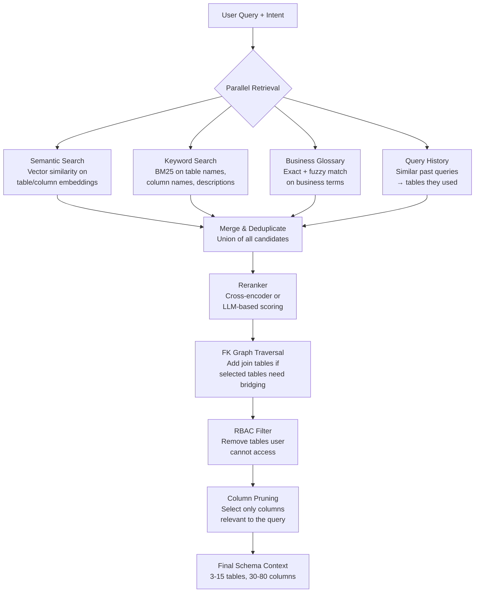

### Strategy Details

#### 1. Semantic Search (Vector Retrieval)

```python
query_embedding = embed("top customers by revenue in Europe")

# Search table descriptions
table_results = vector_store.similarity_search(
    query_embedding,
    collection="table_descriptions",
    top_k=15,
    filter={"is_active": True}
)

# Search column descriptions
column_results = vector_store.similarity_search(
    query_embedding,
    collection="column_descriptions",
    top_k=30,
    filter={"is_active": True}
)
# Map columns back to their parent tables
```

**Strengths:** Catches semantic matches ("earnings" → "revenue"), handles paraphrasing.
**Weaknesses:** Can miss exact keyword matches; embedding quality depends on description quality.

#### 2. Keyword Search (BM25)

```python
# Search table names, column names, and descriptions using BM25
keyword_results = metadata_store.bm25_search(
    query="customers revenue Europe",
    fields=["table_name", "column_name", "description", "business_description"],
    top_k=15
)
```

**Strengths:** Exact match on table/column names (e.g., `dim_customers` matches "customers").
**Weaknesses:** Misses semantic equivalences.

#### 3. Business Glossary Lookup

```python
# Extract entities from intent
entities = intent.entities + intent.metrics  # ["customers", "revenue"]

for entity in entities:
    # Exact match
    term = glossary.lookup(entity)
    if term:
        mapped_columns = term.column_mappings
        # These columns' parent tables are high-confidence candidates

    # Fuzzy match for synonyms
    fuzzy_matches = glossary.fuzzy_search(entity, threshold=0.8)
```

**Strengths:** Highest precision — directly maps business language to schema. Eliminates ambiguity.
**Weaknesses:** Requires manual curation; coverage may be incomplete.

#### 4. Query History Lookup

```python
# Find similar past queries that were successful
similar_queries = query_history.search(
    query_embedding=query_embedding,
    filters={"was_successful": True, "feedback_score": {"$gte": 0.7}},
    top_k=5
)

# Extract tables used in those queries via SQL parsing
for past_query in similar_queries:
    tables_used = parse_tables_from_sql(past_query.generated_sql)
    # These are strong candidates
```

**Strengths:** Leverages proven NL→table mappings from real usage. Gets better over time.
**Weaknesses:** Cold start problem; biased toward frequently queried tables.

#### 5. Reranking

After merging candidates from all strategies (typically 20-40 unique tables), a reranker scores each table's relevance:

```python
# Option A: Cross-encoder reranker (faster, cheaper)
reranker = CrossEncoder("cross-encoder/ms-marco-MiniLM-L-12-v2")
scores = reranker.predict([
    (user_query, table.description) for table in candidates
])

# Option B: LLM-based reranker (more accurate, more expensive)
rerank_prompt = """
Given the user's question and a list of database tables,
score each table's relevance from 0-10.

Question: {query}
Tables:
{table_list_with_descriptions}

Return a JSON array of {table_name, score, reason}.
"""
```

The top 5-10 tables proceed to the next stage.

#### 6. FK Graph Traversal (Join Path Discovery)

```python
# Build adjacency graph from TABLE_RELATIONSHIP table
fk_graph = build_fk_graph(metadata_store)

# For the selected tables, find shortest join paths
selected_tables = ["dim_customers", "fact_orders"]
join_paths = fk_graph.shortest_paths(selected_tables)

# If two selected tables aren't directly joinable,
# add bridge tables (e.g., a junction table)
bridge_tables = identify_bridge_tables(selected_tables, fk_graph)
selected_tables += bridge_tables
```

This ensures the SQL Generator has all the tables needed to write valid JOINs.

### Minimizing Hallucinations

| Hallucination Type | Prevention Strategy |
|---|---|
| **Hallucinated table names** | Validator checks every table in SQL against metadata store |
| **Hallucinated column names** | Validator checks every column against schema |
| **Wrong column for a metric** | Business glossary provides authoritative mappings |
| **Incorrect joins** | FK graph provides validated join paths |
| **Wrong aggregation logic** | Few-shot examples from query history demonstrate correct patterns |
| **Fabricated filter values** | Column statistics provide valid value ranges; sample values shown in prompt |

The defense is layered: the prompt minimizes hallucination likelihood, and the Validator catches any that slip through.

---

## 7. SQL Generation Strategy

### Prompt Engineering Strategy

The SQL generation prompt is dynamically assembled from multiple components. The goal is to provide maximum signal with minimum tokens.

#### Prompt Template Structure

```
[SYSTEM INSTRUCTIONS]     ~200 tokens  - Role, rules, dialect
[SCHEMA CONTEXT]           ~500-2000 tokens - Selected tables/columns
[BUSINESS RULES]          ~100-300 tokens - Glossary definitions
[FEW-SHOT EXAMPLES]       ~300-600 tokens - 3 similar past queries
[USER QUERY + INTENT]     ~100-200 tokens - NL question + parsed intent
[OUTPUT FORMAT]            ~50 tokens  - Expected response structure
─────────────────────────────────────────
Total:                     ~1250-3350 tokens
```

This keeps the input well under 4K tokens, leaving ample room for the model's reasoning and output.

#### Dynamic Prompt Assembly

```python
def build_sql_generation_prompt(state: Text2SQLState) -> str:
    # 1. System instructions (static per dialect)
    system = DIALECT_PROMPTS[state["target_dialect"]]  # snowflake|bigquery|redshift

    # 2. Schema context (compressed DDL)
    schema_context = format_schema_compact(
        tables=state["selected_tables"],
        columns=state["selected_columns"],
        join_paths=state["join_paths"],
    )

    # 3. Business rules from glossary
    business_rules = format_glossary_rules(
        terms=state["intent"].metrics + state["intent"].entities
    )

    # 4. Few-shot examples (retrieved dynamically)
    examples = retrieve_few_shot_examples(
        query=state["user_query"],
        tables=state["selected_tables"],
        top_k=3,
    )

    # 5. User query + structured intent
    query_section = format_query_with_intent(
        query=state["user_query"],
        intent=state["intent"],
    )

    return PROMPT_TEMPLATE.format(
        system=system,
        schema=schema_context,
        rules=business_rules,
        examples=examples,
        query=query_section,
    )
```

#### Schema Compression

Instead of full `CREATE TABLE` DDL, we use a compact format:

```
-- Full DDL (verbose, ~150 tokens per table):
CREATE TABLE dim_customers (
    customer_id INTEGER NOT NULL PRIMARY KEY,
    name VARCHAR(255) NOT NULL,
    email VARCHAR(255),
    region VARCHAR(50),
    segment VARCHAR(50),
    created_at TIMESTAMP DEFAULT CURRENT_TIMESTAMP,
    ...
);

-- Compressed format (~40 tokens per table):
dim_customers: customer_id (INT PK), name (VARCHAR), region (VARCHAR), segment (VARCHAR)
  ↳ "Customer dimension table. region: NA|EMEA|APAC|LATAM"
```

This 3-4x compression allows the prompt to include more tables without exceeding context limits.

#### Dialect-Specific Instructions

```python
DIALECT_PROMPTS = {
    "snowflake": """
        Use Snowflake SQL syntax.
        - Use DATE_TRUNC('quarter', col) not EXTRACT
        - Use ILIKE for case-insensitive matching
        - Use :: for type casting
        - Qualify column names with table aliases
    """,
    "bigquery": """
        Use BigQuery Standard SQL.
        - Use EXTRACT(QUARTER FROM col) for date parts
        - Use backticks for table references: `project.dataset.table`
        - Use SAFE_DIVIDE for division
    """,
}
```

### Multi-Step SQL Generation

For complex queries, the SQL Generator may use chain-of-thought reasoning:

```
Step 1: Identify the base table → fact_orders
Step 2: Identify the dimension table for customer names → dim_customers
Step 3: Determine the join → fact_orders.customer_id = dim_customers.customer_id
Step 4: Apply filter → dim_customers.region = 'Europe'
Step 5: Apply aggregation → SUM(fact_orders.revenue_usd)
Step 6: Apply grouping → GROUP BY dim_customers.name
Step 7: Apply ordering → ORDER BY total_revenue DESC
Step 8: Apply limit → LIMIT 10

Final SQL:
SELECT c.name, SUM(o.revenue_usd) AS total_revenue
FROM fact_orders o
JOIN dim_customers c ON o.customer_id = c.customer_id
WHERE c.region = 'Europe'
GROUP BY c.name
ORDER BY total_revenue DESC
LIMIT 10
```

### SQL Refinement & Self-Correction Loop

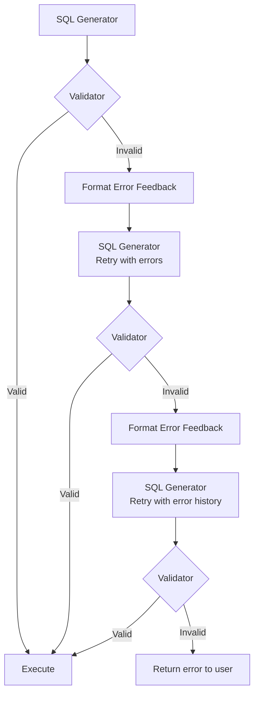

Error feedback is specific and actionable:

```
Your SQL has the following errors:
1. Column "total_sales" does not exist in table "fact_orders".
   Available numeric columns: revenue_usd, quantity, discount_amount
2. Missing GROUP BY clause for non-aggregated column "c.name"

Please fix these errors and regenerate the SQL.
Previous SQL: SELECT c.name, SUM(o.total_sales) FROM ...
```

### Query Optimization Before Execution

The Validator applies these optimizations:

1. **Add LIMIT if missing**: Default `LIMIT 1000` for unbounded queries
2. **Add partition filter**: If the table is partitioned by date and the query has a time range, ensure the WHERE clause uses the partition column
3. **Replace SELECT ***: Narrow to only needed columns
4. **Push down predicates**: Ensure filters are as close to the base table scan as possible
5. **Suggest materialized views**: If a pre-aggregated materialized view exists that satisfies the query, suggest using it

---

## 8. Security & Enterprise Guardrails

### Security Architecture Overview

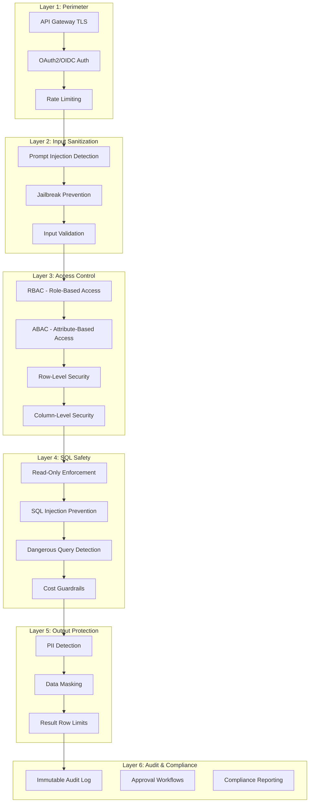

### Guardrail Details

#### Prompt Injection Protection (Layer 2 — Intent Agent)

**Where enforced:** Before the user query reaches any LLM.

```python
class PromptInjectionDetector:
    """Detects attempts to manipulate LLM behavior via the user query."""

    INJECTION_PATTERNS = [
        r"ignore\s+(previous|above|all)\s+instructions",
        r"you\s+are\s+now\s+a",
        r"system\s*prompt",
        r"pretend\s+(you|to)\s+",
        r"<\s*system\s*>",
        r"```\s*(system|prompt)",
    ]

    def detect(self, user_query: str) -> InjectionResult:
        # 1. Regex pattern matching (fast, high precision)
        for pattern in self.INJECTION_PATTERNS:
            if re.search(pattern, user_query, re.IGNORECASE):
                return InjectionResult(detected=True, method="regex")

        # 2. ML classifier (trained on injection datasets)
        score = self.classifier.predict(user_query)
        if score > 0.85:
            return InjectionResult(detected=True, method="classifier")

        return InjectionResult(detected=False)
```

**Response:** Reject the query with a generic message. Do not explain what was detected (to avoid helping attackers iterate).

#### RBAC & ABAC (Layer 3 — Schema Agent)

```python
class AccessControlEngine:
    """Evaluates user access against table and column policies."""

    def check_table_access(self, user: UserContext, table: str) -> bool:
        # RBAC: Role-based check
        if table in self.role_table_map.get(user.role, []):
            return True

        # ABAC: Attribute-based check (department, org, custom attributes)
        policy = self.get_policy(table)
        return policy.evaluate(user.attributes)

    def check_column_access(self, user: UserContext, table: str, column: str) -> bool:
        col_meta = self.metadata.get_column(table, column)
        if col_meta.is_sensitive and "sensitive_data_viewer" not in user.roles:
            return False
        return True

    def apply_row_level_security(self, sql: str, user: UserContext) -> str:
        """Inject row-level predicates based on user's data scope."""
        # Example: sales reps can only see their own region
        if user.role == "sales_rep":
            sql = inject_where_clause(sql, f"region = '{user.region}'")
        return sql
```

**Where enforced:**
- **Table-level RBAC**: Schema Agent filters out unauthorized tables before they reach the SQL Generator
- **Column-level access**: Validator checks column permissions after SQL is generated
- **Row-level security**: Validator injects row-level predicates into the SQL

#### SQL Safety (Layer 4 — Validator Agent + Query Proxy)

**Read-Only Enforcement (defense in depth):**

1. **Validator Agent** (application layer): Parse SQL AST; reject any statement that is not `SELECT`
2. **Query Proxy** (infrastructure layer): Database connection uses a read-only user with `GRANT SELECT` only
3. **Database role** (warehouse layer): The service account has no write permissions

```python
DANGEROUS_SQL_PATTERNS = [
    # DML/DDL
    r"\b(INSERT|UPDATE|DELETE|DROP|TRUNCATE|ALTER|CREATE|GRANT|REVOKE)\b",
    # System commands
    r"\b(EXEC|EXECUTE|CALL|COPY\s+INTO)\b",
    # Unbounded operations
    r"SELECT\s+\*\s+FROM\s+\w+\s*$",  # SELECT * without WHERE or LIMIT
    # Cross-database access attempts
    r"\b(INFORMATION_SCHEMA|PG_CATALOG|SYS\.)\b",
]
```

**Dangerous Query Detection:**
- `CROSS JOIN` without `WHERE` clause → potential cartesian product
- `SELECT *` on tables with 100M+ rows → potential warehouse cost spike
- Queries estimated to scan >10TB → require approval
- Nested subqueries deeper than 4 levels → flag for review

#### PII Protection & Data Masking (Layer 5 — Formatter Agent)

```python
class PIIProtector:
    """Detects and masks PII in query results."""

    def scan_and_mask(self, results: list[dict], user: UserContext) -> list[dict]:
        masked_results = []
        for row in results:
            masked_row = {}
            for col, val in row.items():
                col_meta = self.metadata.get_column_by_name(col)

                # Column-level masking policy
                if col_meta and col_meta.masking_policy:
                    masked_row[col] = self.apply_mask(val, col_meta.masking_policy)

                # Content-based PII detection (catch unlabeled PII)
                elif self.pii_detector.contains_pii(str(val)):
                    masked_row[col] = self.redact(val)

                else:
                    masked_row[col] = val

            masked_results.append(masked_row)
        return masked_results

    def apply_mask(self, value, policy: str) -> str:
        match policy:
            case "redact":    return "***REDACTED***"
            case "hash":      return hashlib.sha256(str(value).encode()).hexdigest()[:12]
            case "truncate":  return str(value)[:3] + "***"
            case "email":     return re.sub(r'(.{2}).*@', r'\1***@', str(value))
```

**Sensitive Column Detection:**
- Columns marked `is_pii=True` or `is_sensitive=True` in metadata store
- Auto-detection during schema sync: column names matching patterns like `ssn`, `social_security`, `credit_card`, `email`, `phone`, `password`, `salary`
- Presidio-based content scanning on query results as a final safeguard

#### Rate Limiting (Layer 1)

```
Per-user:       20 queries/minute, 200 queries/hour
Per-org:        500 queries/minute
LLM tokens:    100K tokens/hour per user
Expensive queries: 5/hour per user (queries estimated >$1 in warehouse compute)
```

#### Approval Workflows (Layer 6)

Certain queries require human approval before execution:

| Trigger | Approver | SLA |
|---------|----------|-----|
| Query scans >10TB | Data Engineering On-Call | 15 min |
| Query accesses restricted tables | Data Owner | 30 min |
| Query returns >100K rows | User's Manager | 5 min |

The LangGraph interrupt mechanism pauses execution and notifies the approver via Slack/email. The graph resumes when approved.

#### Audit Logging

Every query produces an immutable audit record:

```json
{
  "trace_id": "abc-123",
  "timestamp": "2026-06-25T10:30:00Z",
  "user_id": "analyst@corp.com",
  "user_role": "data_analyst",
  "natural_language_query": "Top 10 customers by revenue in Europe",
  "parsed_intent": { ... },
  "tables_accessed": ["dim_customers", "fact_orders"],
  "columns_accessed": ["name", "revenue_usd", "region", "customer_id"],
  "generated_sql": "SELECT ...",
  "validation_result": "passed",
  "rows_returned": 10,
  "execution_time_ms": 245,
  "pii_detected": false,
  "masking_applied": false,
  "feedback": "thumbs_up",
  "total_tokens_used": 2847,
  "total_latency_ms": 1823
}
```

Stored in an append-only table (or shipped to a SIEM like Splunk) for compliance.

---

## 9. Failure Scenarios

### Failure Handling Matrix

| Failure | Detection Point | Response | Retry? |
|---------|----------------|----------|--------|
| **Ambiguous question** | Intent Agent | `NodeInterrupt` → ask clarification | N/A (human resolves) |
| **Missing metadata** | Schema Agent | Return "I don't have information about {entity}. Available domains: ..." | No |
| **Multiple valid interpretations** | Intent Agent | Present top 2-3 interpretations, ask user to choose | N/A (human resolves) |
| **Invalid SQL (syntax)** | Validator Agent | Return parse error to SQL Generator with fix hints | Yes, up to 3x |
| **Invalid SQL (schema)** | Validator Agent | Return "column X doesn't exist, available: [Y, Z]" to SQL Generator | Yes, up to 3x |
| **Database timeout** | Executor Agent | Cancel query, suggest simplification: "Try adding a date filter or reducing the scope" | Once with 2x timeout |
| **Hallucinated tables** | Validator Agent | Caught by schema validation; return to SQL Generator with correct table list | Yes, up to 3x |
| **Hallucinated columns** | Validator Agent | Caught by schema validation; return to SQL Generator with correct column list | Yes, up to 3x |
| **Empty results** | Executor Agent | Return: "No results found. This could mean: (1) No data matches your filters, (2) The date range may be too narrow. Suggestions: ..." | No, but suggest modified query |
| **Permission denied** | Schema Agent / Validator | "You don't have access to {table}. Contact your admin to request access." | No |
| **Expensive query** | Validator Agent | `NodeInterrupt` → require approval or suggest optimization | N/A (approval flow) |
| **Long-running query** | Executor Agent | Progressive timeout: 30s → warn user → 60s → cancel | No, suggest simplification |
| **LLM API failure (5xx)** | LLM Gateway | Retry with exponential backoff (3 attempts), then fallback to secondary LLM | Yes, with fallback |
| **LLM rate limit (429)** | LLM Gateway | Queue and retry after `Retry-After` header; degrade gracefully | Yes, with backoff |
| **Tool failure** | Any Agent | Log error, retry once; if persistent, skip tool and degrade (e.g., skip few-shot examples) | Once |
| **Partial failure** (e.g., vector search down) | Schema Agent | Fall back to keyword search + glossary only; warn that results may be less accurate | No, degrade gracefully |

### Detailed Failure Flows

#### Ambiguous Question Flow

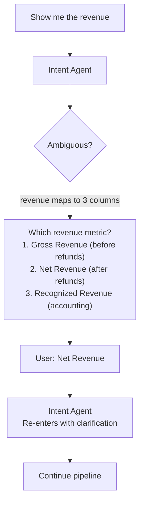

#### Self-Correction Loop

```
Attempt 1:
  SQL: SELECT customer_name, SUM(total_sales) FROM orders ...
  Validation Error: Column "customer_name" does not exist in "orders".
                    Available: customer_id, order_id, amount, ...
                    Did you mean dim_customers.name? Join via customer_id.

Attempt 2:
  SQL: SELECT c.name, SUM(o.amount) FROM orders o
       JOIN dim_customers c ON o.customer_id = c.customer_id ...
  Validation: ✓ PASSED

(Errors from previous attempts are included in the retry prompt
 so the LLM doesn't repeat the same mistake.)
```

#### Graceful Degradation

If the vector store is temporarily unavailable:
1. Schema Agent detects the failure
2. Falls back to keyword search (BM25) + business glossary only
3. Adds caveat to response: "Note: Semantic search was unavailable. Results may be less precise."
4. Alert fires in monitoring for the vector store outage

---

## 10. Scalability

### Scaling Dimensions

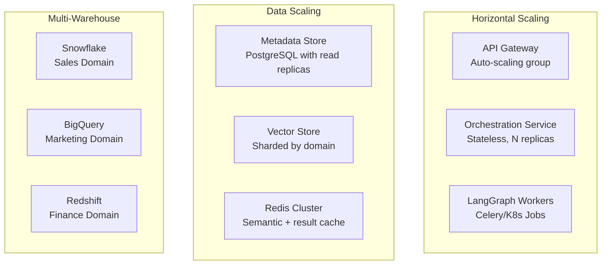

### Thousands of Tables

- **Metadata store**: PostgreSQL handles 10,000+ tables with proper indexing. No scalability concern.
- **Vector index**: 50,000 column embeddings with HNSW index → sub-millisecond search. pgvector handles this easily. At 500K+ embeddings, migrate to Pinecone or Weaviate.
- **Schema sync**: Incremental sync (only changed objects) keeps sync time under 5 minutes even for 10,000+ tables.
- **Domain partitioning**: Tables are tagged by domain (sales, marketing, finance). The Schema Agent searches within the user's domain first, expanding only if needed. This reduces the search space by 5-10x.

### Millions to Billions of Rows

The Text-to-SQL platform doesn't scan data — the warehouse does. Our concerns are:

- **Query cost governance**: The Query Governor estimates scan size before execution and blocks expensive queries
- **Partition awareness**: The SQL Generator is taught to include partition filters (e.g., date ranges) to minimize scanned data
- **Materialized view routing**: If a pre-aggregated view exists for common query patterns, the Schema Agent can route to it instead of base tables
- **Result pagination**: Large result sets are paginated; the Formatter shows the first 100 rows with a "download full results" option

### Multiple Databases & Warehouses

```python
class WarehouseRouter:
    """Routes queries to the correct warehouse based on domain."""

    def __init__(self):
        self.domain_warehouse_map = {
            "sales": WarehouseConfig(type="snowflake", conn="..."),
            "marketing": WarehouseConfig(type="bigquery", conn="..."),
            "finance": WarehouseConfig(type="redshift", conn="..."),
        }

    def route(self, tables: list[TableSchema]) -> dict[str, list[TableSchema]]:
        """Group selected tables by their warehouse."""
        grouped = defaultdict(list)
        for table in tables:
            warehouse = self.domain_warehouse_map[table.domain]
            grouped[warehouse].append(table)
        return grouped
```

**Cross-database queries**: If a query spans multiple warehouses, the system either:
1. **Federated query**: Uses the warehouse's native federation (e.g., Snowflake external tables)
2. **Application-level join**: Executes subqueries against each warehouse, then joins results in the application layer (for small result sets only)
3. **Decline**: If the cross-database join is too complex, inform the user and suggest breaking it into separate queries

### Concurrent Users

- **Orchestration Service**: Stateless; horizontally scaled behind a load balancer. Each request is independent.
- **LangGraph execution**: Each query gets its own graph invocation with a unique thread_id. No shared mutable state between users.
- **LLM concurrency**: The LLM Gateway manages a token bucket per model endpoint. Under high load, requests are queued with priority (interactive queries > batch queries).
- **Database connections**: Connection pool per warehouse, sized per tenant. Connection exhaustion triggers queuing, not failure.
- **Target**: 100+ concurrent users with p95 latency <5s for simple queries.

### Caching Strategy

```
┌─────────────────────────────────────────────────────┐
│  L1: Semantic Query Cache (Redis)                    │
│  Key: embedding of NL query (cosine > 0.95 = hit)    │
│  Value: final formatted response                     │
│  TTL: 1 hour                                         │
│  Hit rate: ~15-25% (many queries are variations)     │
├─────────────────────────────────────────────────────┤
│  L2: SQL Result Cache (Redis)                        │
│  Key: hash(SQL + warehouse + user_permissions)       │
│  Value: query results                                │
│  TTL: 15 min (or until underlying table updates)     │
│  Hit rate: ~10-15%                                   │
├─────────────────────────────────────────────────────┤
│  L3: Metadata Cache (In-process + Redis)             │
│  Key: table/column metadata                          │
│  Value: schema objects, embeddings                   │
│  TTL: 6 hours (refreshed by sync)                    │
│  Hit rate: ~95%+ (metadata changes infrequently)     │
└─────────────────────────────────────────────────────┘
```

### Cost Optimization

| Cost Driver | Optimization |
|-------------|-------------|
| LLM tokens | Semantic cache avoids redundant LLM calls; schema compression reduces input tokens; smaller models for classification tasks |
| Warehouse compute | Query Governor blocks expensive queries; partition filters reduce scan size; result caching |
| Vector search | pgvector (no additional cost) for <100K embeddings; dedicated vector DB only at scale |
| Infrastructure | Stateless services scale to zero during off-hours; spot instances for non-critical workers |

### Multiple LLMs

```python
class LLMGateway:
    """Routes LLM calls based on task type and availability."""

    ROUTING = {
        "intent_classification": "claude-haiku-4-5",      # Fast, cheap
        "schema_reranking":      "claude-haiku-4-5",      # Fast, cheap
        "sql_generation":        "claude-sonnet-4-6",      # Best balance
        "sql_validation":        "claude-haiku-4-5",      # Mostly rule-based
        "response_formatting":   "claude-haiku-4-5",      # Simple task
        "complex_sql":           "claude-opus-4-6",        # Complex reasoning
    }

    FALLBACK_CHAIN = ["claude-sonnet-4-6", "gpt-4o", "claude-haiku-4-5"]
```

Using smaller models for simpler tasks (intent classification, formatting) reduces cost by 5-10x compared to using the most capable model for everything.

---

## 11. Observability

### Observability Stack

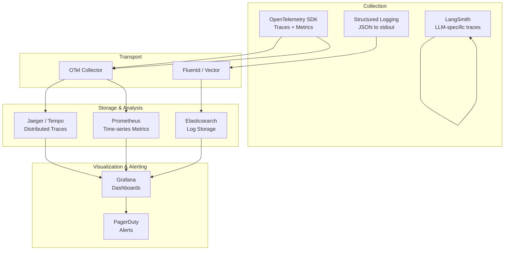

### Key Metrics

#### Agent-Level Traces

Every LangGraph execution produces a trace with spans for each agent:

```
Trace: query-abc-123 (total: 2.1s)
├── authenticate          12ms
├── intent_agent         340ms  (LLM: 280ms, tools: 60ms)
├── schema_agent         620ms  (vector_search: 45ms, bm25: 30ms, rerank: 200ms, fk_graph: 15ms, rbac: 10ms, LLM: 320ms)
├── sql_generator        780ms  (few_shot_retrieval: 80ms, LLM: 700ms)
├── validator_agent      130ms  (parse: 5ms, schema_check: 15ms, rbac_check: 10ms, LLM: 100ms)
├── executor_agent       245ms  (query_execution: 240ms, overhead: 5ms)
└── formatter_agent      280ms  (pii_scan: 30ms, LLM: 250ms)
```

#### Dashboards

| Dashboard | Metrics |
|-----------|---------|
| **Request Overview** | Total queries/min, p50/p95/p99 latency, success rate, cache hit rate |
| **Agent Performance** | Per-agent latency, retry rate, failure rate |
| **LLM Usage** | Tokens in/out per model, cost/hour, latency per model, error rate |
| **SQL Quality** | Validation pass rate, self-correction rate, avg retries before success |
| **User Experience** | Feedback scores (thumbs up %), clarification rate, empty result rate |
| **Security** | Blocked queries (injection attempts, permission denied), PII detections |
| **Cost** | LLM cost/query, warehouse compute cost/query, total platform cost/day |

#### Prompt & SQL Logging

All prompts and SQL are logged (with PII redaction) for debugging:

```python
logger.info("sql_generated", extra={
    "trace_id": state["trace_id"],
    "user_id": state["user_id"],  # pseudonymized in non-prod
    "prompt_tokens": 2100,
    "completion_tokens": 350,
    "model": "claude-sonnet-4-6",
    "sql": state["generated_sql"],
    "tables_used": ["dim_customers", "fact_orders"],
    "validation_passed": True,
    "confidence": 0.92,
})
```

#### Alerting Rules

| Alert | Condition | Severity | Action |
|-------|-----------|----------|--------|
| High error rate | >5% of queries fail in 5min window | P1 | Page on-call |
| LLM degradation | p95 LLM latency >5s | P2 | Investigate, consider fallback |
| Schema sync failure | Sync hasn't completed in 12 hours | P2 | Check warehouse connectivity |
| Injection spike | >10 injection attempts in 1 hour | P1 | Rate limit source IP/user |
| Cost anomaly | Daily LLM cost >2x rolling 7-day average | P3 | Review query patterns |
| Low feedback score | Rolling 24h thumbs-up rate <60% | P3 | Review recent failing queries |

#### User Feedback Collection

```
┌──────────────────────────────────────────────┐
│  Your answer:                                │
│  The top customer in Europe by revenue is    │
│  Acme Corp with $12.4M...                    │
│                                              │
│  SQL used: SELECT c.name, SUM(...)           │
│                                              │
│  Was this helpful?  👍  👎                   │
│                                              │
│  [Correct the SQL] [Report issue]            │
└──────────────────────────────────────────────┘
```

Feedback flows:
1. **Thumbs up**: Stores the NL→SQL pair with a positive score; becomes a candidate for few-shot examples
2. **Thumbs down**: Flags for review; analyst can optionally provide the correct SQL
3. **SQL correction**: Stores the corrected SQL; the original is marked as incorrect
4. **Periodic review**: Data team reviews low-scoring queries weekly to improve glossary, metadata descriptions, and prompts

---

## 12. Workspace Strategy

### Why Workspaces?

With 1000+ tables, even a strong retrieval pipeline (vector search + keyword + glossary) can produce noisy results. The search space is simply too large for reliable table selection. **Workspaces** solve this by pre-partitioning the schema into curated, domain-scoped collections — reducing the effective search space from 1000+ tables to 50-200 per workspace.

This is the single most impactful accuracy lever in the system. Without workspaces, the Schema Agent must search across all tables, leading to:
- False positives (irrelevant tables with similar descriptions)
- Cross-domain confusion ("revenue" exists in sales, finance, and marketing schemas with different semantics)
- Larger prompts (more candidate tables = more noise for the SQL Generator)

### Workspace Architecture

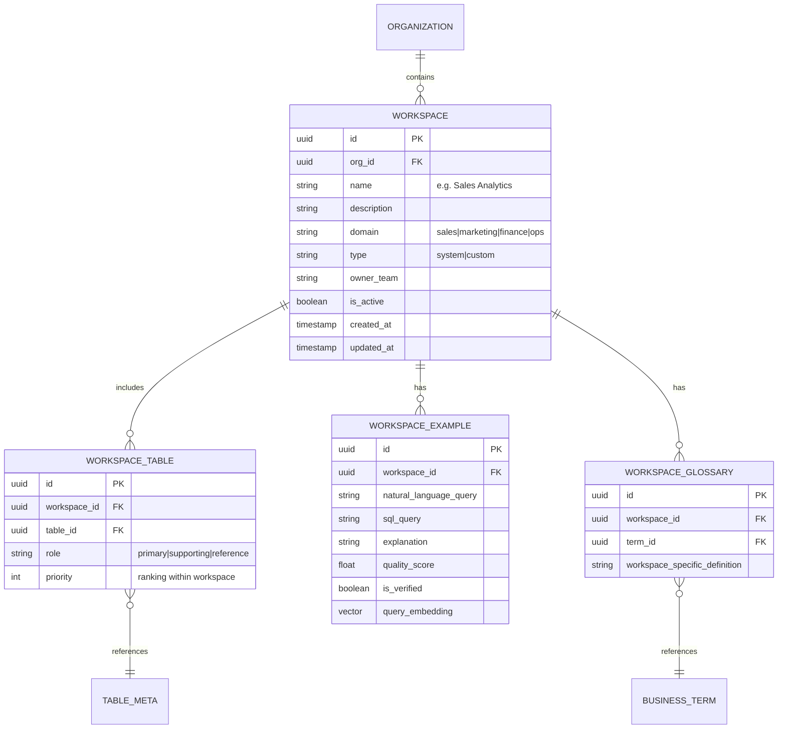

### Workspace Types

| Type | Description | Example | Managed By |
|------|-------------|---------|------------|
| **System Workspace** | Pre-built by data engineering for major business domains. Curated table sets, verified examples, domain-specific glossary. | "Sales Analytics" — 80 tables, 50 SQL examples, sales-specific glossary | Data Engineering team |
| **Custom Workspace** | Created by teams or individuals for niche use cases, projects, or cross-domain analysis. | "Q4 Campaign Analysis" — 30 tables from marketing + sales | Any user with create permission |
| **Auto-Generated Workspace** | System-generated from usage patterns — tables frequently queried together are clustered into suggested workspaces. | "Customer 360" — auto-detected cluster of customer-related tables | System (requires admin approval to activate) |

### How Workspaces Integrate with the Agent Pipeline

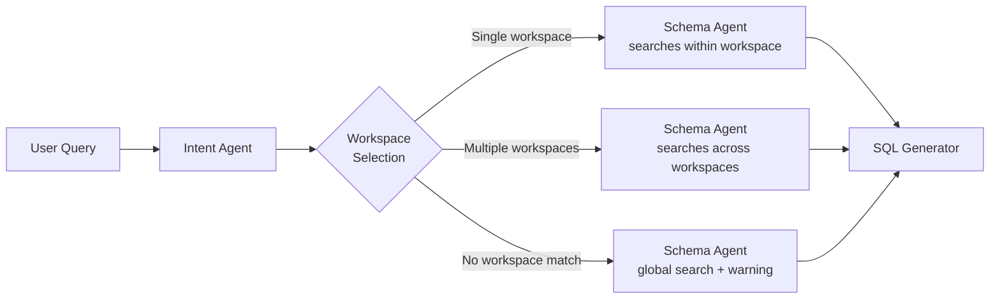

**Workspace selection logic:**

1. **User-specified**: If the user has a default workspace or explicitly selects one (via UI dropdown or query prefix like "[Sales] top customers by revenue"), use that workspace directly.
2. **Intent-based routing**: The Intent Agent classifies the query's domain and maps it to 1-2 workspaces. This uses a combination of:
   - Keyword matching against workspace names/descriptions
   - Semantic similarity between query embedding and workspace description embeddings
   - User's department and historical workspace usage patterns
3. **Multi-workspace queries**: If the query spans domains (e.g., "compare marketing spend to sales revenue"), the Schema Agent searches across the relevant workspaces and flags the cross-domain nature.
4. **Fallback**: If no workspace matches confidently, fall back to global search with a caveat.

### Impact on Retrieval Quality

```
Without workspaces:
  1000+ tables → vector search → 20-30 candidates (noisy) → rerank → 10 tables
  Table selection accuracy: ~70-75%

With workspaces:
  1000+ tables → workspace filter → 50-200 tables → vector search → 10-15 candidates (focused) → rerank → 5-8 tables
  Table selection accuracy: ~88-92%
```

The workspace pre-filter eliminates most false positives before vector search even runs, dramatically improving downstream accuracy.

### Few-Shot Examples per Workspace

Each workspace contains **curated NL→SQL examples** that serve as few-shot context for the SQL Generator:

- **Verified examples**: Manually reviewed and approved by domain experts (highest priority)
- **High-feedback examples**: Automatically promoted from query history when users give positive feedback
- **Diverse coverage**: Examples cover different query patterns (ranking, aggregation, trend, comparison) for the workspace's tables

When the SQL Generator runs, it retrieves few-shot examples **from the active workspace first**, falling back to global query history only if workspace examples are insufficient.

### Workspace Lifecycle

| Event | Action |
|-------|--------|
| New tables added to warehouse | Schema sync notifies workspace owners; new tables suggested for relevant workspaces |
| Table dropped | Removed from workspaces; examples referencing it are flagged for review |
| Low query accuracy in a workspace | Alert to workspace owner; triggers review of examples and glossary entries |
| Workspace unused for 90 days | Auto-archived; can be restored |
| User creates custom workspace | Available only to creator initially; can be shared with team or promoted to system workspace |

---

## 13. Evaluation & Testing Strategy

### Why This Matters

A Text-to-SQL system without a rigorous evaluation framework is flying blind. Prompt changes, model upgrades, schema modifications, and retrieval tuning can all silently degrade quality. The evaluation strategy ensures:
- **Measurable quality**: Concrete accuracy metrics that can be tracked over time
- **Regression prevention**: Automated tests that catch quality degradation before it reaches production
- **Continuous improvement**: Feedback loops that systematically improve the system

### Evaluation Metrics

| Metric | Definition | Target | How Measured |
|--------|-----------|--------|-------------|
| **Execution Accuracy (EX)** | % of queries where the generated SQL produces the correct result set | ≥ 85% | Compare results against gold-standard SQL |
| **Table Selection Recall** | % of required tables correctly identified by Schema Agent | ≥ 92% | Compare selected tables against ground truth |
| **Table Selection Precision** | % of selected tables that are actually needed | ≥ 85% | Unnecessary tables increase prompt noise |
| **Column Selection Accuracy** | % of required columns correctly identified | ≥ 90% | Compare selected columns against ground truth |
| **Join Accuracy** | % of queries with correct JOIN conditions | ≥ 95% | AST-level comparison of JOIN clauses |
| **Semantic Equivalence** | % of queries where generated SQL is logically equivalent to gold SQL (even if syntactically different) | ≥ 88% | Execute both, compare result sets |
| **Intent Classification Accuracy** | % of queries where intent is correctly parsed | ≥ 93% | Compare against labeled intent dataset |
| **Clarification Rate** | % of queries that require human clarification | ≤ 15% | Lower is better, but 0% means under-detection of ambiguity |
| **End-to-End Latency (p95)** | 95th percentile total latency excluding query execution | ≤ 4s | Measured in production |
| **User Satisfaction** | % of queries receiving positive feedback (thumbs up) | ≥ 75% | Collected from production feedback |

### Golden Query Dataset

The foundation of evaluation is a **curated dataset of NL→SQL pairs** with verified correct results.

```python
@dataclass
class GoldenQuery:
    id: str
    workspace: str                    # Which workspace this belongs to
    natural_language: str             # The user's question
    gold_sql: str                     # Verified correct SQL
    gold_tables: list[str]            # Tables that should be selected
    gold_columns: list[str]           # Columns that should be selected
    expected_intent: dict             # Expected intent parse result
    complexity: str                   # simple | medium | complex
    category: str                     # ranking | aggregation | trend | comparison | lookup
    requires_joins: bool
    requires_window_functions: bool
    gold_result_hash: str             # Hash of correct result set for fast comparison
    created_by: str                   # Who created this test case
    last_verified: datetime           # When the gold SQL was last verified against live data
```

**Dataset composition:**

| Category | Count per Workspace | Notes |
|----------|-------------------|-------|
| Simple queries (single table, direct aggregation) | 40-50 | Cover common patterns |
| Medium queries (2-3 tables, JOINs, filters) | 30-40 | Most common production queries |
| Complex queries (4+ tables, CTEs, window functions) | 15-20 | Edge cases and stress tests |
| Ambiguous queries (should trigger clarification) | 10-15 | Verify the system asks for help when it should |
| Out-of-scope queries (unanswerable) | 5-10 | Verify graceful "can't answer" responses |
| **Total per workspace** | **100-135** | |
| **System-wide (10 workspaces)** | **1000-1350** | |

**Golden dataset maintenance:**
- New entries sourced from production queries with positive feedback (auto-suggested, manually verified)
- Low-scoring production queries reviewed weekly; correct SQL added as new golden entries
- Schema changes trigger re-verification of affected golden queries
- Dataset version-controlled alongside prompts in Git

### Automated Evaluation Pipeline

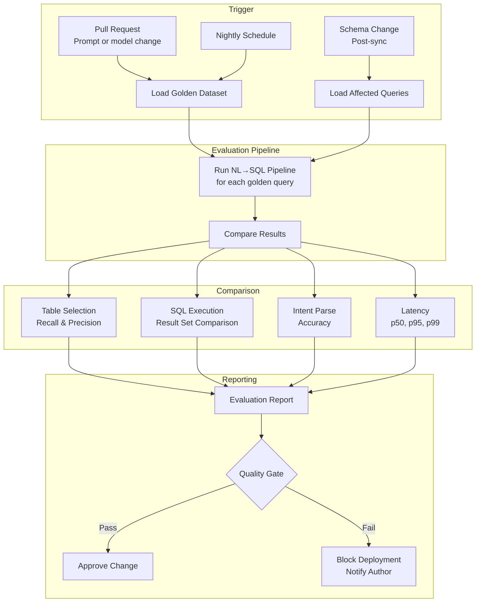

**Quality gates for deployment:**

```python
QUALITY_GATES = {
    "execution_accuracy": {"min": 0.83, "regression_threshold": 0.02},  # Must be ≥83%, can't drop >2%
    "table_selection_recall": {"min": 0.90, "regression_threshold": 0.03},
    "intent_accuracy": {"min": 0.91, "regression_threshold": 0.02},
    "p95_latency_ms": {"max": 4000},  # Excluding SQL execution time
}

def evaluate_quality_gate(current: dict, baseline: dict) -> tuple[bool, list[str]]:
    """Returns (passed, list of failure reasons)."""
    failures = []
    for metric, thresholds in QUALITY_GATES.items():
        if "min" in thresholds and current[metric] < thresholds["min"]:
            failures.append(f"{metric}: {current[metric]:.2f} below minimum {thresholds['min']}")
        if "max" in thresholds and current[metric] > thresholds["max"]:
            failures.append(f"{metric}: {current[metric]} exceeds maximum {thresholds['max']}")
        if "regression_threshold" in thresholds:
            regression = baseline[metric] - current[metric]
            if regression > thresholds["regression_threshold"]:
                failures.append(f"{metric}: regressed by {regression:.2f} (threshold: {thresholds['regression_threshold']})")
    return (len(failures) == 0, failures)
```

### A/B Testing Framework

When changing prompts, models, or retrieval strategies, run A/B tests to measure real-world impact:

```python
class ABTestConfig:
    experiment_name: str          # e.g., "sonnet-4-vs-sonnet-4.5-sql-gen"
    control_variant: str          # Current production configuration
    treatment_variant: str        # Proposed change
    traffic_split: float          # 0.1 = 10% traffic to treatment
    min_sample_size: int          # Minimum queries before concluding (e.g., 500)
    primary_metric: str           # "execution_accuracy"
    guardrail_metrics: list[str]  # ["p95_latency_ms", "cost_per_query"]
    duration_days: int            # Maximum test duration
```

**A/B test assignment:** Deterministic based on `hash(user_id + experiment_name)` — ensures a user always sees the same variant within a test, while distributing evenly across users.

**Metrics tracked per variant:**
- Execution accuracy (from user feedback + automated checks)
- User satisfaction (thumbs up rate)
- Latency (p50, p95)
- Cost per query (LLM tokens + warehouse compute)
- Clarification rate
- Self-correction rate (how often Validator rejects SQL)

### Component-Level Testing

| Component | Test Type | What's Tested |
|-----------|-----------|---------------|
| Intent Agent | Unit tests | Intent parsing on labeled dataset; ambiguity detection precision/recall |
| Schema Agent | Integration tests | Table selection recall/precision against golden set; RBAC filtering correctness |
| SQL Generator | Unit + integration | SQL execution accuracy; dialect correctness; few-shot example impact |
| Validator | Unit tests | True positive rate (catches bad SQL); false positive rate (doesn't reject good SQL) |
| Business Glossary | Coverage tests | % of production queries where glossary provided a mapping; unmapped terms alert |
| Retrieval Pipeline | Benchmark tests | Recall@10, Recall@20 for table retrieval; latency per strategy |
| End-to-End | Integration tests | Full pipeline execution accuracy on golden dataset |

### Continuous Improvement Flywheel

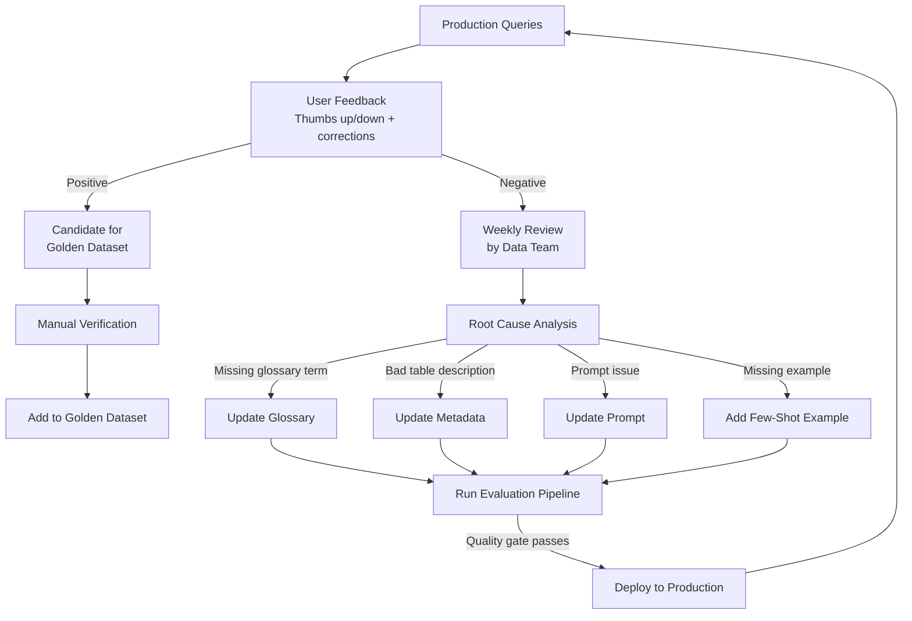

This creates a **virtuous cycle**: production usage generates feedback → feedback improves the system → improved system generates better results → users provide more positive feedback.

### Prompt Regression Testing

Prompts are treated as code — version-controlled, reviewed, and tested:

```
prompts/
├── intent_agent/
│   ├── v1.0.txt          # Original prompt
│   ├── v1.1.txt          # Added time range handling
│   └── changelog.md      # What changed and why
├── sql_generator/
│   ├── snowflake_v2.0.txt
│   ├── bigquery_v2.0.txt
│   └── changelog.md
└── evaluation/
    ├── golden_queries.json
    └── baseline_metrics.json  # Metrics from current production prompts
```

**Every prompt change triggers:**
1. Full golden dataset evaluation
2. Comparison against baseline metrics
3. Quality gate check
4. If passed: merge and deploy
5. If failed: block merge, notify author with specific regressions

---

## 14. Architecture Decisions

### Decision 1: Separate Agents vs. Single Monolithic Prompt

| Aspect | Decision |
|--------|----------|
| **Chosen** | 6 specialized agents in a LangGraph pipeline |
| **Alternative** | Single LLM call with all schema context and instructions |
| **Why chosen** | (1) 1000+ tables cannot fit in a single prompt. (2) Each agent has a focused objective, reducing error rate. (3) Validation is decoupled from generation, creating a security boundary. (4) Agents can use different models (cheaper for simple tasks). (5) Failures are isolated and recoverable. |
| **Trade-off** | Higher total latency (multiple LLM calls) and complexity. Mitigated by parallel tool calls within agents and semantic caching. |
| **Limitation** | More infrastructure to manage; requires careful state passing between agents. |

### Decision 2: LangGraph vs. Alternatives

| Aspect | Decision |
|--------|----------|
| **Chosen** | LangGraph for agentic orchestration |
| **Alternatives** | CrewAI, AutoGen, Temporal + custom agents, plain Python async |
| **Why chosen** | (1) First-class conditional routing and cycles (needed for retry loops). (2) Built-in checkpointing for human-in-the-loop and crash recovery. (3) LangSmith integration for observability. (4) Production deployment support via LangGraph Platform. (5) Active community and Anthropic/OpenAI model support. |
| **Trade-off** | Vendor coupling to LangChain ecosystem. Mitigated by keeping agent logic in pure Python functions that are framework-agnostic. |
| **Limitation** | Learning curve; debugging can be opaque without LangSmith. |

### Decision 3: pgvector vs. Dedicated Vector Database

| Aspect | Decision |
|--------|----------|
| **Chosen** | pgvector (PostgreSQL extension) for vector storage, with migration path to Pinecone |
| **Alternatives** | Pinecone, Weaviate, Qdrant, Milvus, Chroma |
| **Why chosen** | (1) Simplifies infrastructure — metadata and vectors in one database. (2) At 50K embeddings, pgvector with HNSW delivers sub-millisecond search. (3) Transactional consistency between metadata and embeddings. (4) No additional vendor dependency. |
| **Trade-off** | Doesn't scale to millions of embeddings as well as dedicated vector DBs. |
| **Migration trigger** | Move to Pinecone when embedding count exceeds 500K or when multi-region replication is needed. |

### Decision 4: Hybrid Retrieval vs. Pure Semantic Search

| Aspect | Decision |
|--------|----------|
| **Chosen** | Hybrid retrieval (semantic + keyword + glossary + history) with reranking |
| **Alternative** | Pure semantic (vector) search |
| **Why chosen** | (1) Semantic search misses exact keyword matches (table `dim_customers` for query "customers"). (2) Business glossary provides the highest-precision mappings for domain terms. (3) Query history provides proven NL→table mappings. (4) Reranking combines signals from all strategies for optimal recall+precision. |
| **Trade-off** | More complex retrieval pipeline; slightly higher latency (~100ms overhead). |
| **Benefit** | Significantly higher table selection accuracy (estimated 90%+ vs. ~70% for pure semantic). |

### Decision 5: Read-Only Proxy vs. Application-Level SQL Filtering

| Aspect | Decision |
|--------|----------|
| **Chosen** | Defense-in-depth: application-level SQL AST validation + infrastructure-level read-only proxy + database-level read-only role |
| **Alternative** | Application-level regex filtering only |
| **Why chosen** | (1) No single layer is sufficient — LLMs can generate creative SQL that bypasses regex. (2) AST parsing catches structural issues. (3) Read-only proxy prevents bypass even if the application is compromised. (4) Database role is the last line of defense. |
| **Trade-off** | Three layers of enforcement adds complexity. |
| **Benefit** | Near-zero risk of accidental data mutation. Required for enterprise compliance. |

### Decision 6: Semantic Cache

| Aspect | Decision |
|--------|----------|
| **Chosen** | Embedding-based semantic cache (cosine similarity > 0.95 = cache hit) |
| **Alternative** | Exact string match cache only |
| **Why chosen** | Users frequently ask the same question with different phrasing ("top customers by revenue" vs "highest revenue customers"). Semantic cache catches these variations. |
| **Trade-off** | Risk of false-positive cache hits if threshold is too low. 0.95 cosine threshold is conservative. |
| **Benefit** | 15-25% cache hit rate; reduces LLM costs and latency for repeat patterns. |

### Decision 7: Business Glossary as a First-Class Component

| Aspect | Decision |
|--------|----------|
| **Chosen** | Curated business glossary with authoritative term→column mappings |
| **Alternative** | Rely entirely on LLM to infer column meanings from names and descriptions |
| **Why chosen** | Enterprise schemas are ambiguous. "Revenue" might map to `gross_revenue`, `net_revenue`, `recognized_revenue`, or `arr`. Without a glossary, the LLM guesses — and guessing is unacceptable for financial reporting queries. Industry experience consistently shows this as the #1 accuracy lever. |
| **Trade-off** | Requires manual curation and ongoing maintenance. |
| **Benefit** | Eliminates the #1 source of semantic errors in Text-to-SQL systems. |

### Decision 8: Multiple LLM Models by Task

| Aspect | Decision |
|--------|----------|
| **Chosen** | Route different tasks to different model tiers (Opus for complex SQL, Haiku for classification) |
| **Alternative** | Use a single model for all tasks |
| **Why chosen** | (1) Intent classification and formatting don't need the most expensive model. (2) Cost reduction of 5-10x on ~60% of LLM calls. (3) Smaller models are faster, reducing latency for simple tasks. |
| **Trade-off** | Must maintain prompt compatibility across models; occasional quality differences. |
| **Benefit** | Estimated 60-70% reduction in LLM costs with negligible quality impact. |

---

## Appendix A: Technology Stack Summary

| Layer | Technology | Justification |
|-------|-----------|---------------|
| API Gateway | Kong / AWS API Gateway | Mature, supports rate limiting, auth plugins |
| Auth | Okta / Auth0 (OIDC) | Enterprise SSO integration |
| Backend | FastAPI (Python) | Async, fast, excellent LangChain/LangGraph ecosystem |
| Agent Orchestration | LangGraph | See Decision 2 |
| LLM Primary | Claude Sonnet 4.6 | Best cost/quality for SQL generation |
| LLM Complex | Claude Opus 4.6 | Complex multi-table reasoning |
| LLM Fast | Claude Haiku 4.5 | Classification, formatting |
| Embedding | OpenAI text-embedding-3-large | High quality, 3072-dim |
| Vector Store | pgvector (PostgreSQL) | See Decision 3 |
| Metadata Store | PostgreSQL 16 | Relational schema + pgvector in one DB |
| Cache | Redis Cluster | Semantic + result + metadata cache |
| Message Queue | Kafka / SQS | Async audit logging, schema sync triggers |
| Observability | OpenTelemetry + Grafana + LangSmith | Full stack coverage |
| Audit Log | PostgreSQL (append-only) + S3 archive | Compliance |
| Deployment | Kubernetes (EKS/GKE) | Horizontal scaling, health checks |

## Appendix B: Deployment Architecture

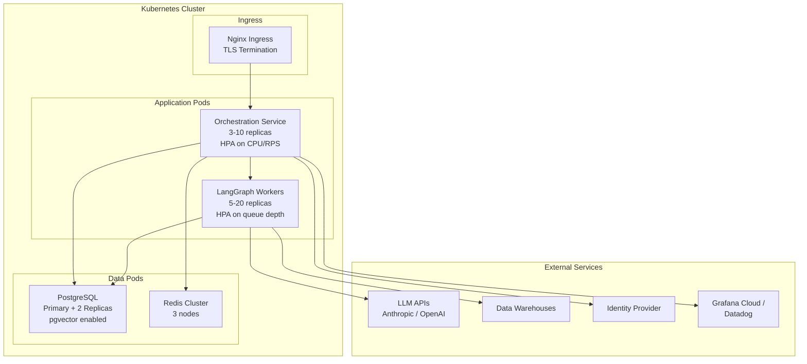

## Appendix C: Cost Estimate (Illustrative)

For an enterprise with 2000 tables, 500 daily active users, ~5000 queries/day:

| Component | Monthly Cost (est.) |
|-----------|-------------------|
| LLM API (mixed models, with caching) | $3,000 - $8,000 |
| Kubernetes cluster (3-10 nodes) | $2,000 - $5,000 |
| PostgreSQL (RDS/Cloud SQL) | $500 - $1,500 |
| Redis Cluster | $300 - $800 |
| Observability (Grafana Cloud) | $500 - $1,500 |
| Warehouse compute (incremental) | $1,000 - $5,000 |
| **Total** | **$7,300 - $21,800** |

This is significantly cheaper than the engineering hours saved. Industry benchmarks from large-scale Text-to-SQL deployments report 60-70% reductions in query authoring time. Even at conservative estimates, a Text-to-SQL platform pays for itself many times over.
